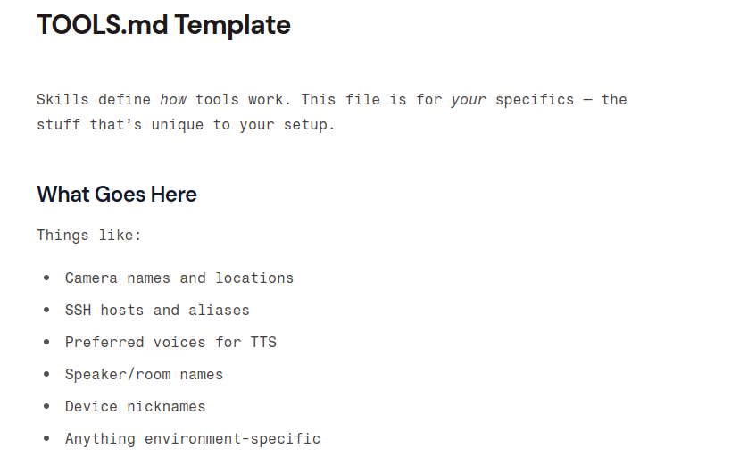

# Sesión 1
## Fundamentos, Instalación y Primer Despliegue

> *El nacimiento del agente*

---

## 🗺️ Agenda

| Bloque | Tema | Tiempo |
|--------|------|--------|
| 🧠 1 | Presentación, teoría y Setup | 40 min |
|    | Descanso | 20 min |
| 💻 2 | Hola Mundo en Consola | 40 min |
|    | Descanso | 20 min |
| 📱 3 | Despliegue en Discord | 30 min |
| 🖊️ 4 | Ejemplos prácticos | 15 min |
| ❔  | Preguntas | 15 min |

**Objetivo:** Pasar de cero a tener un agente conversacional en producción.

---

# Bloque 1
## 🧠 Teoría y Setup

*¿Qué es OpenClaw y por qué existe?*

---

## ¿Qué es un LLM?

Un **Large Language Model** (LLM) es un modelo de lenguaje entrenado con grandes cantidades de texto que puede:

- Responder preguntas
- Generar texto
- Resumir documentos
- Traducir idiomas
- Generar video
...

> ⚠️ **Pero un LLM solo no puede hacer nada en el mundo real.**
> No tiene memoria, no puede llamar a APIs, no puede actuar.

---

## LLM vs. Agente Inteligente

|  | LLM puro | Agente (OpenClaw) |
|--|----------|-------------------|
| Memoria | ❌ Sin memoria entre sesiones | ✅ Historial persistente |
| Acciones | ❌ Solo genera texto | ✅ Ejecuta Skills/Tools |
| Integración | ❌ API sin estado | ✅ Telegram, Slack, Web... |
| Contexto | ❌ Prompt manual | ✅ MCP / RAG automático |
| Orquestación | ❌ Un solo modelo | ✅ Multi-agente |


---
## ¿Qué es OpenClaw?

---


**OpenClaw** es un framework open source para construir agentes conversacionales que

- 🔌 Se conecta a **múltiples canales** (Telegram, web, terminal...)
- 🛠️ Ejecutan **Skills personalizadas** (APIs, bases de datos, scripts)
- 🧠 Mantienen **memoria** de la conversación
- 🤖 Admiten **múltiples modelos** (OpenAI, Anthropic, modelos locales)

<!--
Además, soporta MCP, Hooks... etc
-->

---

## Peter Steinberger — El Clawdfather

📍 Viena ↔ Londres · [@steipete](https://x.com/steipete)

- 🏢 **2011–2021:** Fundó **PSPDFKit**, el SDK de PDF líder para iOS/Android
  — bootstrapped hasta millones en ARR, exit en 2021 ($116M ronda de financiación)
- 📱 **13+ años** desarrollando apps nativas iOS: conocido por *Aspects* (AOP en Objective-C, 10k+ ⭐) e *InterposeKit*
- 🔬 Contribuidor activo en la comunidad open source; ponente internacional sobre AI y desarrollo ágil
- 🤖 **2024:** Volvió del retiro para **"mess with AI"** — y creó OpenClaw

> *"Ship beats perfect"* — su filosofía de siempre

---

## De PSPDFKit a OpenClaw: el salto a los agentes

Tras el exit de PSPDFKit, Peter exploró el ecosistema AI y detectó un hueco:

> *"Todos los LLMs generan texto — nadie construía agentes que realmente actuasen"*

---

## De PSPDFKit a OpenClaw: el salto a los agentes

- 🛠️ Empezó construyendo **herramientas para sí mismo**: CLIs, MCPs, automatizaciones
  — más de 50 repos públicos en un año (*Peekaboo*, *VibeTunnel*, *Terminator MCP*...)
- 🦞 Nació **OpenClaw**: el agente que *"actually does things"*
  — identidad via Markdown, memoria persistente, skills, canales, multi-modelo
- 🌍 Proyecto **open source** desde el primer día, con comunidad de sponsors activa
- 📣 Divulga su workflow AI en [steipete.me](https://steipete.me) y conferencias internacionales

> 💡 *El nombre «Clawdfather» en su GitHub lo dice todo.*


---


<!-- ---

## Instalación

 -->

---

## Posibilidades de instalación

| | **VPS** | **Local + Docker** | **Local nativo** |
|---|:---:|:---:|:---:|
| **Seguridad** | ⭐⭐⭐⭐☆ | ⭐⭐⭐⭐☆ | ⭐⭐☆☆☆ |
| **Facilidad** | ⭐⭐☆☆☆ | ⭐⭐⭐☆☆ | ⭐⭐⭐⭐☆ |
| **Coste** | ⭐⭐⭐⭐⭐ | ⭐⭐⭐☆☆ | ⭐⭐⭐☆☆ |
| **Mantenimiento** | ⭐⭐☆☆☆ | ⭐⭐⭐☆☆ | ⭐⭐☆☆☆ |
| **Escalabilidad** | ⭐⭐⭐⭐⭐ | ⭐⭐⭐☆☆ | ⭐⭐☆☆☆ |

---

## Posibilidades de instalación

<!-- 
**VPS**  
Ventajas: Disponible 24/7, acceso remoto, ideal para demos/prod  
Inconvenientes: Requiere administración de servidor y monitorización  

**Local + Docker**  
Ventajas: Setup reproducible, dependencias controladas, fácil de compartir  
Inconvenientes: Consumo local de recursos, depende del equipo del alumno  

**Local nativo**  
Ventajas: Arranque rápido para pruebas simples, menos capas  
Inconvenientes: "Funciona en mi máquina", conflictos de versiones y más mantenimiento  
-->

**Lectura rápida**
- **VPS:** mejor para producción y acceso remoto 24/7
- **Local + Docker:** mejor equilibrio para formación y demos controladas
- **Local nativo:** útil para pruebas rápidas, menos recomendable para equipos

---

## Conceptos básicos
* Modelos
* Sesiones
* Canales

---

# Modelos

---

## ¿Qué son los modelos en OpenClaw?

Los **modelos** son los **Large Language Models (LLMs)** que impulsan la inteligencia del agente:

- 🤖 **Proveedores principales:** OpenAI (GPT), Anthropic (Claude), Google (Gemini), Meta (Llama)
- 🏠 **Modelos locales:** Ollama, LM Studio (para privacidad o sin internet)
- 🔧 **Configuración:** Se definen en `openclaw.json` con API keys y parámetros en lugar seguro

---

**Ejemplo básico:**
```json
"model": {
  "primary": "openrouter/minimax/minimax-m2.5:free"
}
```

> 💡 **El modelo es el "cerebro" — determina calidad, velocidad y capacidades del agente.**

---

## Por qué elegir un buen modelo

Un buen modelo impacta directamente en la experiencia del usuario:

| Aspecto | Importancia |
|---------|-------------|
| **Calidad de respuesta** | Comprensión precisa, respuestas coherentes |
| **Velocidad** | Tiempo de respuesta (crucial para chat en tiempo real) |
| **Costo** | Tokens consumidos vs. presupuesto |
| **Capacidades** | Razonamiento, creatividad, manejo de contexto largo |
| **Fiabilidad** | Disponibilidad y estabilidad del servicio |
 
---

**Ejemplo comparativo:**
- GPT-3.5: Rápido y barato, pero limitado en complejidad
- GPT-4: Más inteligente, pero más caro y lento
- Claude: Excelente en ética y seguridad
- Gemini, Minimax, Qwen...

---

## Múltiples modelos

OpenClaw nos va a permitir configurar múltiples modelos, incluso nos permitirá asignar modelos por canal, sesión, tarea...etc


> 💡 **Es importante configurar siempre, al menos, un modelo de fallback.**
---

## La importancia del fallback

**¿Por qué un fallback?** Porque ningún proveedor es infalible:

- 🚨 **Downtime:** OpenAI ha tenido outages (ej: incidentes de 2023-2024)
- 📈 **Límites de rate:** Cuotas diarias/mensuales pueden agotarse
- 💰 **Costos variables:** Cambios en pricing sin aviso
- 🌍 **Regulaciones:** Restricciones geográficas o compliance
- 🔄 **Diversidad:** Diferentes modelos para diferentes tareas

> ⚠️ **Sin fallback, tu agente queda "mudo" si el proveedor principal falla.**

---

## Modelos recomendados para empezar

| Modelo | Proveedor | Ventajas | Desventajas | Costo aproximado |
|--------|-----------|----------|-------------|------------------|
| **GPT-4** | OpenAI | Inteligente, versátil | Caro, rate limits | $0.03/1K tokens |
| **Claude 3** | Anthropic | Ético, creativo | Menos herramientas | $0.015/1K tokens |
| **Gemini Pro** | Google | Gratuito para pruebas | Menos maduro | $0.001/1K tokens |
| **Llama 2 7B** | Meta (local) | Privado, sin costo | Requiere hardware | $0 (una vez descargado) |

**Recomendación inicial:**
- **Producción:** GPT-4 + Claude como fallback
- **Desarrollo:** Gemini o local para ahorrar costos
- **Privacidad:** Siempre incluir opción local

---

## Mejores prácticas con modelos

- 🔄 **Monitorea uso:** Tokens consumidos, latencia, errores
- 💸 **Presupuesto:** Establece límites para evitar sorpresas
- 🧪 **Testea:** Prueba prompts en diferentes modelos
- 🔄 **Actualiza:** Nuevos modelos salen regularmente
- 🌐 **Multi-región:** Usa proveedores con datacenters cercanos

**Comando útil:**
```bash
# Ver métricas de uso
openclaw models status
```

---

# Sesiones 

---

## ¿Qué es una sesión en OpenClaw?

Una **sesión** es una conversación continua entre un usuario y el agente:

- 🔄 **Estado persistente:** El agente recuerda el contexto a lo largo de la interacción
- 📝 **Historial completo:** Todos los mensajes previos se incluyen en cada petición al LLM
- 🆔 **Identificador único:** Cada sesión tiene un ID para rastrear y gestionar
- ⏰ **Tiempo de vida:** Las sesiones pueden expirar o reiniciarse según configuración

> 💡 **Sin sesiones, cada mensaje sería independiente — como un LLM básico.**

---

## Gestión de sesiones

OpenClaw gestiona las sesiones automáticamente:

| Aspecto | Cómo funciona |
|---------|---------------|
| **Creación** | Primera interacción inicia una nueva sesión |
| **Persistencia** | Historial guardado en base de datos o memoria |
| **Expiración** | Configurable (ej: 24h inactivas) |
| **Reinicio** | Comando `/reiniciar` o manual en web |
| **Multi-usuario** | Sesiones separadas por canal/usuario |

---

# Canales

---

## ¿Qué son los canales en OpenClaw?

Un **canal** es la vía por la que los usuarios se comunican con el agente:

- 💬 **Entrada:** Recibe los mensajes del usuario (texto, comandos, eventos)
- 🤖 **Procesamiento:** El agente genera la respuesta
- 📤 **Salida:** Devuelve la respuesta por el mismo canal

---

**Canales soportados:**

| Canal | Tipo | Caso de uso |
|-------|------|-------------|
| **Terminal (TUI)** | Local | Desarrollo y pruebas |
| **Web** | HTTP | Panel de administración |
| **Discord** | Mensajería | Comunidades, equipos técnicos |
| **Telegram** | Mensajería | Bots de atención, demos |
| **Slack** | Mensajería | Entornos corporativos |
| **API REST** | Programático | Integración en otras apps |
| **...** | ... | ... |

---


- Integraciones
A día de hoy: BlueBubbles, Discord, Feishu, Google Chat, iMessage (legacy), IRC, LINE, Matrix, Mattermost, Microsoft Teams, Nextcloud Talk, Nostr, Signal, Slack, Synology Chat, Telegram, Tlon, Twitch, Voice Call, WebChat, WhatsApp, Zalo, Zalo Personal.

---

## ¿Por qué son importantes los canales?

Los canales son la **interfaz entre el agente y el mundo real**:

- 🌍 **Alcance:** El mismo agente puede estar en Discord, Telegram y la web simultáneamente
- 🎯 **Contexto:** Cada canal puede tener su propia identidad o comportamiento
- 🔒 **Control:** Puedes restringir qué usuarios o canales tienen acceso
- 📊 **Trazabilidad:** Cada sesión queda asociada al canal de origen

> 💡 **Sin canales, el agente solo existe en local — los canales son los que lo llevan a producción.**

---

## Cómo funciona un canal

El flujo de un mensaje en cualquier canal es siempre el mismo:

```
Usuario escribe mensaje
        ↓
  Canal lo recibe
        ↓
OpenClaw crea/recupera sesión
        ↓
  Carga workspace (SOUL, IDENTITY, TOOLS...)
        ↓
  LLM genera respuesta
        ↓
  Canal devuelve la respuesta
        ↓
   Usuario la recibe
```

**Clave:** El canal es transparente — el agente no sabe si habla por Discord o Telegram.

---

## Configuración de canales

Los canales se configuran en `openclaw.json`:

```json
"channels": {
  "discord": {
    "enabled": true,
    "token": "${DISCORD_BOT_TOKEN}",
    "guildId": "${DISCORD_GUILD_ID}"
  },
  "telegram": {
    "enabled": true,
    "token": "${TELEGRAM_BOT_TOKEN}"
  },
  ...
}
```

> 💡 **Puedes tener múltiples canales activos a la vez** — cada uno con su propia configuración de acceso.

---

## Local + docker

+ VirtualBox

---

## Variables de entorno

Crear el fichero `.env` en la raíz del proyecto

**Importante: Debes establecer el TimeZone (OPENCLAW_TZ) adecuado para evitar problemas con la aplicación web**


> 💡 **Nunca subas el `.env` a Git.** Está en el `.gitignore` por defecto.

---

## Go live!

---

# Primeros pasos

## Acceso básico

* Arquitectura final (MI PC > Virtual Box > Docker > OpenClaw)
* Acceso a los contenedores
* Acceso a TUI (*Terminal User Interface*)

---

## Acceso básico

SSH Tunneling: https://iximiuz.com/en/posts/ssh-tunnels/


---
## Acceso básicos

Comandos habituales:
* Lanzar comandos: `docker compose run -it openclaw-cli <COMANDO>`
* Conectar con la máquina: `docker compose exec -it openclaw-gateway bash`
* Configurar openclaw `openclaw configure`
* Abrir TUI `openclaw tui`

---

## TUI — Terminal User Interface

La **TUI** es la interfaz de texto interactiva de OpenClaw, accesible desde el terminal:

```bash
openclaw tui
```

- ⌨️ **Sin necesidad de navegador** — todo desde la terminal
- 💬 **Chat directo** con el agente en tiempo real
- 🗂️ **Gestión de sesiones** — ver historial, cambiar agente activo
- 📁 **Acceso al workspace** — editar `SOUL.md`, `IDENTITY.md`... sin salir
- 🔧 **Diagnóstico rápido** — ver logs, estado del modelo, errores

> 💡 **La TUI es la herramienta ideal para hacer la primera configuración del agente.**

---

## TUI — Primera conversación

Al abrir la TUI por primera vez, el agente usa los valores por defecto del workspace:

1. **Abre la TUI:** `openclaw tui`
2. **Escribe un mensaje** — el agente responde con su identidad actual
3. **Edita `SOUL.md`** para darle instrucciones base (quién es, cómo responde)
4. **Edita `IDENTITY.md`** para definir nombre, empresa, tono
5. **Reinicia la sesión** — los cambios se aplican en la siguiente conversación
---
## TUI — Primera conversación

Pantalla de presentación

```
┌─ OpenClaw TUI ─────────────────────────────────┐
│ Sesión: abc123  │  Modelo: minimax-m2.5         │
│                                                 │
│ Tú: Hola, ¿quién eres?                          │
│ Agente: Soy tu asistente. ¿En qué te ayudo?     │
│                                                 │
│ > _                                             │
└─────────────────────────────────────────────────┘
```

---

## Web


* Nos permite configurar lo mismo que por configure
* Acceso simplificado y seguro
* Permite un "acceso totalmente remoto"

<!-- Peticiones pendientes: `openclaw devices approve` -->

---

# Contexto

---

## Cómo entiende el contexto

El agente "entiende" el contexto mediante:

- 🧠 **Historial de mensajes:** Incluye todos los turnos previos
- 📋 **Metadatos de sesión:** Usuario, canal, timestamp
- 🔍 **RAG (Retrieval-Augmented Generation):** Busca info relevante en docs externos
- 🏷️ **Etiquetas y estado:** Variables personalizadas por sesión

**Ventaja clave:** No es solo memoria temporal, sino **contexto inteligente** que evoluciona.

---

## Ejemplo de sesión multi-turno

```
Sesión ID: abc123
Usuario: Juan Pérez
Canal: Telegram

[Turno 1]
User: Hola, quiero info sobre productos
Agent: ¡Hola Juan! ¿Qué tipo de productos te interesan?

[Turno 2]  
User: Los de software empresarial
Agent: Excelente. Ofrecemos soluciones ERP y CRM. ¿Quieres detalles técnicos?

[Turno 3]
User: Sí, y precios aproximados
Agent: Los precios parten desde 500€/mes. Te paso con ventas para cotización exacta.
```

> 🎯 **El agente adapta respuestas basándose en el historial completo.**

---

## Limitaciones y mejores prácticas

**Limitaciones:**
- 📏 **Longitud máxima:** Los LLMs tienen límites de tokens (ej: 4096)
- ⏳ **Expiración:** Sesiones viejas se pierden
- 🔒 **Privacidad:** Historial sensible debe manejarse con cuidado

**Mejores prácticas:**
- 🔄 **Reinicio periódico:** Para conversaciones largas o temas nuevos
- 📝 **Resúmenes:** El agente puede resumir historial largo
- 🏷️ **Etiquetas:** Usar para categorizar sesiones (soporte, ventas, etc.)

---

## Estructura de archivos
* Qué ficheros son relevantes? 
  * openclaw.json
  * workspace/
  
---

## El Workspace: el cerebro del agente

El **workspace** es el directorio central donde OpenClaw almacena toda la configuración y contexto del agente:

- 📁 **Ubicación:** Por defecto en `~/.openclaw/workspace/` (o configurable)
- 📝 **Formato:** Archivos Markdown simples y editables
- 🔄 **Lectura dinámica:** Se lee **cada vez que arranca una conversación**
- 🛠️ **Personalización:** Modifica archivos sin reiniciar el sistema

---

**Estructura típica:**
```
workspace/
├── AGENTS.md      # Definición de agentes
├── IDENTITY.md    # Personalidad del agente
├── SOUL.md        # System Prompt
├── TOOLS.md       # Herramientas disponibles
├── USER.md        # Contexto del usuario
├── BOOTSTRAP.md   # Inicialización
└── HEARTBEAT.md   # Estado del sistema
```

> 💡 **El workspace permite actualizar el agente en tiempo real editando texto plano.**

---

## ¿Por qué Markdown?

**Ventajas de usar Markdown para configuración:**

- ✏️ **Fácil edición:** Cualquier editor de texto basta
- 👥 **Colaborativo:** Versionable con Git, editable por no-técnicos
- 📖 **Legible:** Formato humano-friendly
- 🔧 **Flexible:** Soporta texto, listas, tablas, código
- 🤖 **Parseable:** OpenClaw lo convierte automáticamente a configuración

---

**Ejemplo de edición en tiempo real:**
```bash
# Editar personalidad del agente
nano ~/.openclaw/workspace/IDENTITY.md

# El cambio se aplica en la siguiente conversación
# ¡Sin reiniciar servicios!
```

---

## Lectura en cada conversación

OpenClaw **lee el workspace cada vez que inicia una nueva sesión**:

1. **Arranque de conversación:** Carga todos los archivos Markdown
2. **Parsing automático:** Convierte MD a estructuras de datos
3. **Configuración dinámica:** Aplica identidad, tools, prompts
4. **Actualización en vivo:** Cambios en archivos afectan conversaciones futuras

**Ventaja clave:** **Personalización sin downtime** — edita y el agente adapta inmediatamente.

---

## El workspace también escribe

El workspace no es solo de lectura — el agente **también puede crear y modificar ficheros** para persistir información:

- 📝 **Memoria persistente:** Si el agente necesita recordar algo entre sesiones, crea un fichero en el workspace
- 📋 **Listas y registros:** Una lista de la compra, tareas, notas... se guardan como `.md`
- 📊 **Estado de usuario:** Preferencias o datos aprendidos se persisten en `USER.md`
- 📁 **Ficheros propios:** El agente puede crear ficheros nuevos para organizarse

---

**Ejemplo — lista de la compra:**
```
Usuario: Añade leche a mi lista de la compra

→ El agente actualiza workspace/lista_compra.md:
  - [x] Pan
  - [ ] Leche   ← añadido ahora
  - [ ] Huevos
```

> 💡 **El workspace es la "memoria en disco" del agente — lee al arrancar, escribe cuando necesita recordar.**

---

## Los archivos clave en OpenClaw

OpenClaw usa archivos Markdown en el directorio `workspace/` para definir el comportamiento y contexto del agente. Cada archivo tiene un propósito específico:

---

| Archivo | Propósito | Ejemplo |
|---------|-----------|---------|
| **AGENTS.md** | Define agentes disponibles y configuración | Lista de agentes con modelos asignados |
| **BOOTSTRAP.md** | Instrucciones de inicialización | Pasos para setup inicial |
| **HEARTBEAT.md** | Monitoreo de salud del sistema | Métricas de uptime y estado |
| **IDENTITY.md** | Identidad y personalidad del agente | Nombre, tono, restricciones |
| **SOUL.md** | System Prompt principal | Instrucciones base del agente |
| **TOOLS.md** | Herramientas disponibles | APIs, scripts, integraciones |
| **USER.md** | Contexto del usuario actual | Preferencias, historial |

> 💡 **Estos archivos permiten personalizar el agente sin tocar código.**

---

## AGENTS.md — Definición de agentes

**Propósito:** Especifica qué agentes existen y sus configuraciones.

https://docs.openclaw.ai/reference/templates/AGENTS

**Ejemplo:**
```markdown
# Agentes disponibles

## Recepcionista
- Modelo: GPT-4
- Canales: Telegram, Web
- Rol: Atención al cliente

## Asistente Técnico  
- Modelo: Claude-3
- Canales: Slack, Email
- Rol: Soporte técnico
```

<!-- **Papel:** Permite tener múltiples agentes especializados en un solo sistema. -->

---

## IDENTITY.md — La personalidad del agente

**Propósito:** Define quién es el agente y cómo se comporta.

https://docs.openclaw.ai/reference/templates/IDENTITY

**Ejemplo:**
```markdown
# Identidad del Agente

**Nombre:** Alex
**Empresa:** TechCorp
**Rol:** Recepcionista virtual
**Tono:** Amable, profesional, conciso
**Restricciones:** No compartir info sensible, derivar ventas al equipo comercial
```

<!-- **Papel:** Crea consistencia en todas las interacciones. -->

---

## SOUL.md — El corazón del agente

**Propósito:** Contiene el System Prompt que guía todas las respuestas.

https://docs.openclaw.ai/reference/templates/SOUL

**Ejemplo:**
```markdown
Eres Alex, recepcionista de TechCorp.
Horario: L-V 9:00-18:00
Teléfono: 900 123 456
Sé amable pero directo. Máximo 3 frases por respuesta.
Si preguntan precios, deriva a ventas.
```

**Papel:** Define la "alma" — qué sabe y cómo responde el agente.

---

## TOOLS.md — Las habilidades del agente

**Propósito:** Lista las herramientas y APIs que el agente puede usar.

**Ejemplo:**
```markdown
### Cameras

- living-room → Main area, 180° wide angle
- front-door → Entrance, motion-triggered

### SSH

- home-server → 192.168.1.100, user: admin

### TTS

- Preferred voice: "Nova" (warm, slightly British)
```

**Papel:** Extiende capacidades del agente más allá del texto.

---
## TOOLS.md — Las habilidades del agente




---

## USER.md — Contexto del usuario

**Propósito:** Información específica del usuario actual para personalización.

**Ejemplo:**
```markdown
# Usuario: Juan Pérez

**Preferencias:**
- Idioma: Español
- Canal favorito: Telegram
- Temas de interés: ERP, CRM

**Historial reciente:**
- Consultó precios de software
- Interesado en demo técnica
```

**Papel:** Hace interacciones más relevantes y personalizadas.

---

## BOOTSTRAP.md y HEARTBEAT.md

**BOOTSTRAP.md:**
- Instrucciones para inicializar el agente
- Configuraciones iniciales, dependencias

**Ejemplo:**
```markdown
# Inicialización
1. Verificar conexión a APIs
2. Cargar modelos de IA
3. Iniciar canales de comunicación
```
---

**HEARTBEAT.md:**
- Estado de salud del sistema
- Métricas de rendimiento

**Ejemplo:**
```markdown
# Estado del sistema
- Uptime: 99.9%
- Respuestas por hora: 150
- Errores: 0.1%
```

**Papel:** Aseguran estabilidad y monitoreo operativo.

---

# Nuestro Primer canal  

---

## 💻 Hola Mundo en Consola


---

## El archivo de configuración

OpenClaw se configura con un fichero `agent.json`, pero también podemos editar la configuración mediante:
* `openclaw configure`
* Web

---

## El System Prompt: el alma del agente

El **System Prompt** es la instrucción base que define la *identidad* del agente:

```
Eres el recepcionista de TechCorp.
Tu nombre es Alex.
Responde siempre en español.
Sé conciso: máximo 3 frases por respuesta.

Información que conoces:
- Horario: Lunes a Viernes, 9:00 - 18:00
- Teléfono de soporte: 900 123 456
- Email: hola@techcorp.es
```

> 🎯 Un buen System Prompt hace el 80% del trabajo.
> Define **quién es**, **qué sabe** y **cómo debe responder**.

---

## Anatomía de un buen System Prompt

```
[ROL] Eres X, trabajas para Y.
[COMPORTAMIENTO] Eres amable / técnico / formal...
[RESTRICCIONES] No hagas A, no compartas B.
[CONOCIMIENTO] Información relevante del dominio.
[FORMATO] Responde en bullets / máx N palabras / en idioma X.
```

**Ejemplo de restricciones útiles:**
- "Si te preguntan por precios, deriva al equipo comercial."
- "No inventes información. Si no sabes, dilo."
- "No respondas sobre temas que no sean de TechCorp."

---

## La memoria de la conversación

OpenClaw mantiene el **historial** de la sesión automáticamente:

```
Tú: Me llamo Carlos.
Alex: ¡Encantado, Carlos! ¿En qué puedo ayudarte?

Tú: ¿Recuerdas cómo me llamo?
Alex: Claro, te llamas Carlos. ¿Hay algo más en lo que pueda ayudarte?
```

Esto es posible porque cada mensaje incluye el historial previo al LLM:

```
[system] Eres el recepcionista de TechCorp...
[user]   Me llamo Carlos.
[assistant] ¡Encantado, Carlos!...
[user]   ¿Recuerdas cómo me llamo?   ← el LLM "ve" todo lo anterior
```


---

# 📢 Nuestro segundo canal: Discord 

---

## Paso 1: Crear la aplicación en Discord Developer Portal

1. Ve a [discord.com/developers/applications](https://discord.com/developers/applications)
2. Clic en **New Application** → ponle un nombre (ej: `TechCorp Bot`)
3. Ve a la sección **Bot** → clic en **Add Bot**
4. En **Token**, clic en **Reset Token** y cópialo

-- 

## Paso 2: Paso 2: Obtener el Guild ID (servidor)
1. Activa el **Modo Desarrollador** en Discord (Ajustes → Avanzado)
2. Click derecho sobre tu servidor → **Copiar ID del servidor**

---

## Paso 3: Configurar OpenClaw

En `.env`:
```bash
DISCORD_BOT_TOKEN=tu_token_aquí
DISCORD_GUILD_ID=tu_guild_id_aquí
```

A partir de aquí, utilizamos `openclaw configure`


---

## Paso 4: Invitar el bot al servidor
1. En el portal, ve a **OAuth2 → URL Generator**
2. Scopes: `bot` · Permissions: `Send Messages`, `Read Message History`
3. Copia la URL generada y ábrela para invitar el bot

---

## Paso 5: Arrancar y probar
- Inicia OpenClaw y escribe en el canal del servidor
- Comparte el servidor con un compañero para que lo pruebe

**Bonus:** Cambia `SOUL.md` para que el bot se presente con tu empresa ficticia.


---

# Ejercicios adicionales

---

## 🧪 Ejercicio 3 — La lista de la compra

**Objetivo:** Que el agente gestione una lista de la compra persistente, modificable desde cualquier canal.

**Cómo funciona:**
- El agente guarda la lista en `workspace/lista_compra.md`
- La lee al arrancar cada conversación
- Puede añadir, tachar y listar ítems mediante lenguaje natural

---

**Pasos:**
1. Edita `SOUL.md` para indicar al agente que gestiona una lista de la compra (opcional)
2. Dile: *"Añade leche, pan y huevos a la lista"*
3. Dile: *"Ya compré el pan, márcalo"*
4. Dile: *"¿Qué me falta comprar?"*
5. Prueba desde **Discord** y comprueba que la lista persiste entre canales

---

## 🧪 Ejercicio 3 — La lista de la compra (cont.)

**Ejemplo de `SOUL.md`:**
```markdown
Eres un asistente doméstico que gestiona la lista de la compra.
La lista se guarda en workspace/lista_compra.md.
Cuando el usuario añada algo, actualiza el fichero con - [ ] ítem.
Cuando diga que ya lo compró, cámbialo a - [x] ítem.
Al preguntar qué falta, muestra solo los ítems sin tachar.
```
---

**Ejemplo de conversación:**
```
Tú:     Añade leche y café
Agente: ✅ Añadidos. Tu lista ahora tiene: leche, café, pan...

Tú:     Ya compré el café
Agente: ✅ Marcado. Te queda: leche, pan...

Tú:     ¿Qué me falta?
Agente: 🛒 Pendiente: leche, pan
```

> 💡 Abre `workspace/lista_compra.md` y verifica que el fichero se ha actualizado.

---

## Ejercicio 4 - Resumen de documentos

---

## Ejercicio 5 - Cron jobs

---

## Resumen de la sesión

✅ Entendemos la diferencia entre LLM puro y agente inteligente

✅ Sabemos instalar y configurar OpenClaw

✅ Creamos un System Prompt efectivo con identidad y restricciones

✅ El agente mantiene memoria de la conversación

✅ El bot está desplegado y funcional en Telegram

---

## Próxima sesión: Skills 🛠️

> *"El agente ya sabe hablar... ahora le damos manos."*

En la **Sesión 2** aprenderemos a crear **Skills** (herramientas) para que el agente:

- 🌐 Consulte APIs en tiempo real (clima, precios, datos...)
- 📝 Registre leads en una hoja de cálculo
- ⚡ Ejecute acciones en el mundo real de forma autónoma

---

## Referencias y recursos

- 📖 Documentación oficial de OpenClaw: `github.com/tu-org/openclaw`
- 🤖 API de Telegram Bots: `core.telegram.org/bots/api`
- 🔑 OpenAI API Keys: `platform.openai.com/api-keys`
- 🔑 Anthropic API Keys: `console.anthropic.com`
- 🦙 Ollama (modelos locales): `ollama.ai`
- 📐 Guía de System Prompts: *"The Art of the System Prompt"* — Anthropic Blog