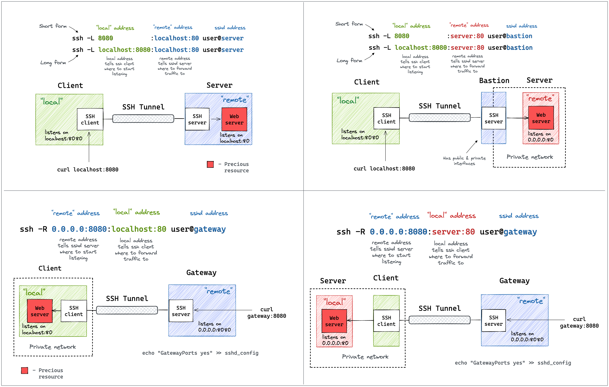

# Session 01 notes


## Instalación de máquina virtual

Olvidar...
sudo apt update
sudo apt install -y dkms build-essential linux-headers-generic virtualbox-guest-x11

sudo mkdir -p /media/cdrom
sudo mount /dev/cdrom /media/cdrom
sudo /media/cdrom/VBoxLinuxAdditions.run


check: lsmod | grep vboxguest


* Cambiar la configuración de red a bridge

## 2 instalaciones

Nativo

https://docs.openclaw.ai/install

Docker

https://docs.openclaw.ai/install/docker

Pasos:
* Instalar docker: https://docs.docker.com/engine/install/ubuntu/
* hay que añadir github a know_hosts
mkdir -p ~/.ssh
ssh-keyscan github.com >> ~/.ssh/known_hosts

## VirtualBox

Listar VMs (sin GUI)

VBoxManage list runningvms

Obtener datos:

VBoxManage guestproperty enumerate OpenClaw


### Con imagen externa
Podemos probar con OPENCLAW_IMAGE=ghcr.io/openclaw/openclaw:latest

OPENCLAW_IMAGE=ghcr.io/openclaw/openclaw:latest ./docker-setup.sh

## Configuración

Vamos a usar https://openrouter.ai/

API: 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

https://openrouter.ai/docs/guides/coding-agents/openclaw-integration

Discord: MTQ4NDA5Mjc4NDc2Njg4MTg3Mg.GUd7HJ.-EKcQ8cvLwgLGyxjw_XqwZbWq65Cpbnr0vu2Hg


Qué pasa si falla..?

## Modelo 

https://openrouter.ai/

## Cancelo setup a medias??


## Conectar a openclaw


Hay que explicar qué es el gateway el cli, diferencias...
Hay que explicar los hooks (los pide en la instalación)
    │
◆  Enable hooks?
│  ◻ Skip for now
│  ◻ 🚀 boot-md (Run BOOT.md on gateway startup)
│  ◻ 📎 bootstrap-extra-files
│  ◻ 📝 command-logger
│  ◻ 💾 session-memory

Comentar el tema del config override

Config overwrite: /home/node/.openclaw/openclaw.json (sha256 70206a2649c026269d7d82dfd28dfc1435bd014394233ac871e7b2b424637e94 -> fb6fe0d0b992990e4c6c0b4f318f7632d79a0eab7fcc01df8d5278f4712142e1, backup=/home/node/.openclaw/openclaw.json.bak)


◇  Install missing skill dependencies
│  Skip for now
│
◇  Set GOOGLE_PLACES_API_KEY for goplaces?
│  No
│
◇  Set GEMINI_API_KEY for nano-banana-pro?
│  No
│
◇  Set NOTION_API_KEY for notion?
│  No
│
◇  Set OPENAI_API_KEY for openai-image-gen?
│  No
│
◇  Set OPENAI_API_KEY for openai-whisper-api?
│  No
│
◆  Set ELEVENLABS_API_KEY for sag?


Integrar mailtrap.io ??


# Bloque 3
## 📱 Despliegue en Telegram

*Del terminal al mundo real en 15 minutos*

---

## ¿Por qué Telegram?

- ✅ API de bots **gratuita y estable**
- ✅ No requiere servidor web ni HTTPS para empezar (long polling)
- ✅ OpenClaw tiene integración **nativa** — sin código extra
- ✅ Los alumnos pueden probarlo desde su **móvil** en tiempo real
- ✅ Ideal para **demos** y **prototipos** corporativos

---

## Paso 1: Crear el bot en BotFather

1. Abre Telegram y busca **@BotFather**
2. Envía `/newbot`
3. Elige un nombre para tu bot: `TechCorp Recepcionista`
4. Elige un username (debe terminar en `bot`): `techcorp_recep_bot`
5. BotFather te dará un **token**:

```
Done! Congratulations on your new bot.
Use this token to access the HTTP API:
7123456789:AAF8xQ3mN...Zk9
```

> 🔐 **Guarda este token. Es la llave de tu bot.**

---

## Paso 2: Conectar el token a OpenClaw

Añade la configuración de Telegram en tu `agent.yaml`:

```yaml
# agent.yaml
name: recepcionista
# ... resto de configuración ...

channels:
  telegram:
    enabled: true
    token: "${TELEGRAM_BOT_TOKEN}"   # leer del .env
```

Y en tu `.env`:

```bash
TELEGRAM_BOT_TOKEN=7123456789:AAF8xQ3mN...Zk9
```

---

## Paso 3: Arrancar el bot

```bash
# Iniciar OpenClaw con canal Telegram
python -m openclaw run --config agent.yaml

# Verás:
# ✅ OpenClaw v1.x iniciado
# 📱 Telegram: escuchando (long polling)
# 🤖 Bot activo: @techcorp_recep_bot
```

Ahora abre Telegram, busca tu bot por su username y envía `/start`.

---

## ¡El bot responde! 🎉

```
Tú: /start

Bot: ¡Hola! Soy Alex, el asistente virtual de TechCorp.
     ¿En qué puedo ayudarte hoy?

Tú: Quiero información sobre vuestros productos

Bot: Con mucho gusto. TechCorp ofrece soluciones de software
     empresarial. Para información detallada sobre productos
     y precios, puedo conectarte con nuestro equipo comercial.
     ¿Quieres que lo haga?
```

---

## Comandos útiles del bot

Puedes definir **comandos Telegram** en el `agent.yaml`:

```yaml
channels:
  telegram:
    enabled: true
    token: "${TELEGRAM_BOT_TOKEN}"
    commands:
      - command: start
        description: Iniciar conversación
      - command: ayuda
        description: Ver qué puedo hacer
      - command: reiniciar
        description: Borrar historial y empezar de nuevo
```

---

## 🧪 Ejercicio 2 — Bot en Discord

> *En pairing — un alumno comparte pantalla*


---

Instalación en windows con wsl1:
```
dism.exe /online /enable-feature /featurename:Microsoft-Windows-Subsystem-Linux /all /norestart

dism.exe /online /enable-feature /featurename:VirtualMachinePlatform /all /norestart

wsl --set-default-version 1

wsl --install

curl -fsSL https://openclaw.ai/install.sh | bash

Install node
curl -o- https://raw.githubusercontent.com/nvm-sh/nvm/v0.39.7/install.sh | bash

salir

nvm install 24


Set-ExecutionPolicy -ExecutionPolicy RemoteSigned -Scope CurrentUser

>npm install -g openclaw@2026.4.12
>openclaw onboard --install-daemon 
```


```
# Install OpenClaw
iwr -useb https://openclaw.ai/install.ps1 | iex

# Install daemon
openclaw onboard --install-daemon

Configuración > Sistema > Para programadores y activa el interruptor "Habilitar sudo". 

# Execution policy (powershell)
Set-ExecutionPolicy -Scope CurrentUser Unrestricted

>npm install -g openclaw@2026.4.12
>openclaw onboard --install-daemon 
```


```
# Install OpenClaw
# iwr -useb https://openclaw.ai/install.ps1 | iex

# Install daemon
# openclaw onboard --install-daemon

# Execution policy (powershell)
# Set-ExecutionPolicy -Scope CurrentUser Unrestricted

wsl --update
wsl --install Ubuntu
```

## Acceso básico

* Arquitectura final (MI PC > Virtual Box > Docker > OpenClaw)
* Acceso a los contenedores
* Acceso a TUI (*Terminal User Interface*)

---

## Acceso básico

SSH Tunneling: https://iximiuz.com/en/posts/ssh-tunnels/



---
## Acceso básicos

Comandos habituales:
* Lanzar comandos: `docker compose run -it openclaw-cli <COMANDO>`
* Conectar con la máquina: `docker compose exec -it openclaw-gateway bash`
* Configurar openclaw `openclaw configure`
* Abrir TUI `openclaw tui`